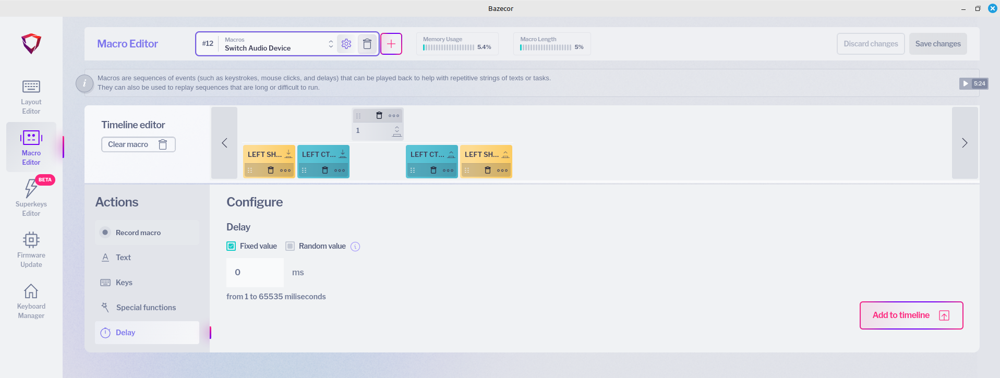
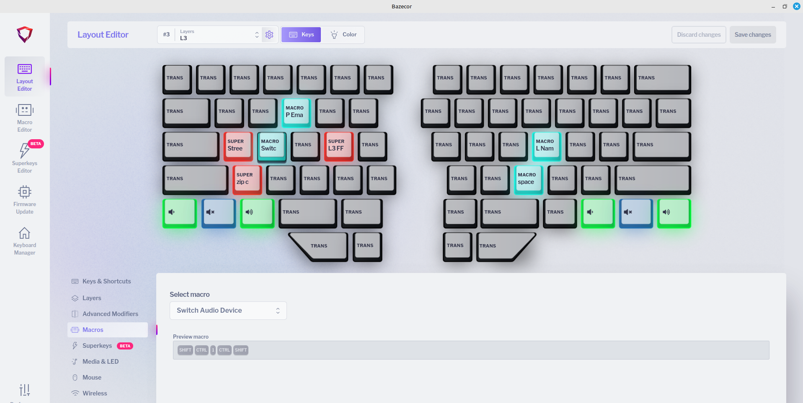

# switch-audio-device
Cycle through available audio output devices

## Save the script somewhere in $PATH
For me, this is `~/bin/switch-audio.py`

### Invocation

#### Assign a shortcut
I use `xbindkeys`. Setup of this for extra mouse buttons are explained at [here](https://github.com/jemshad/dot-files/wiki/xbindkeys)

Append the following in `~/.xbindkeysrc`
```
"$HOME/bin/switch-audio.py"
  shift+control+1
```

#### Make it even shorter
With the help of a macro configured on my [Dygma Raise 2](https://dygma.com/pages/dygma-raise-2), I now have a shortcut that can cycle audio output between the available devices.

##### Configure macro
I created a macro to input `Ctrl+Shift+1` and named it `Switch Audio Device`



##### Shortcut to shortcut
On layer3 of the keyboard, I created a shortcut to invoke the above macro. Now, along with other macros on Layer3, pressing `s` key on 3rd layer will switch the audio device.



